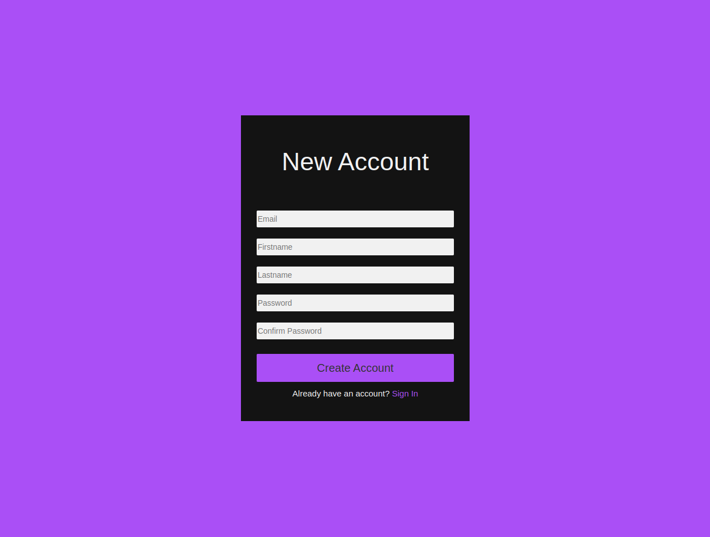
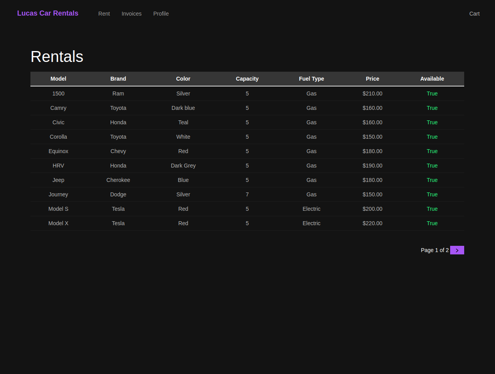
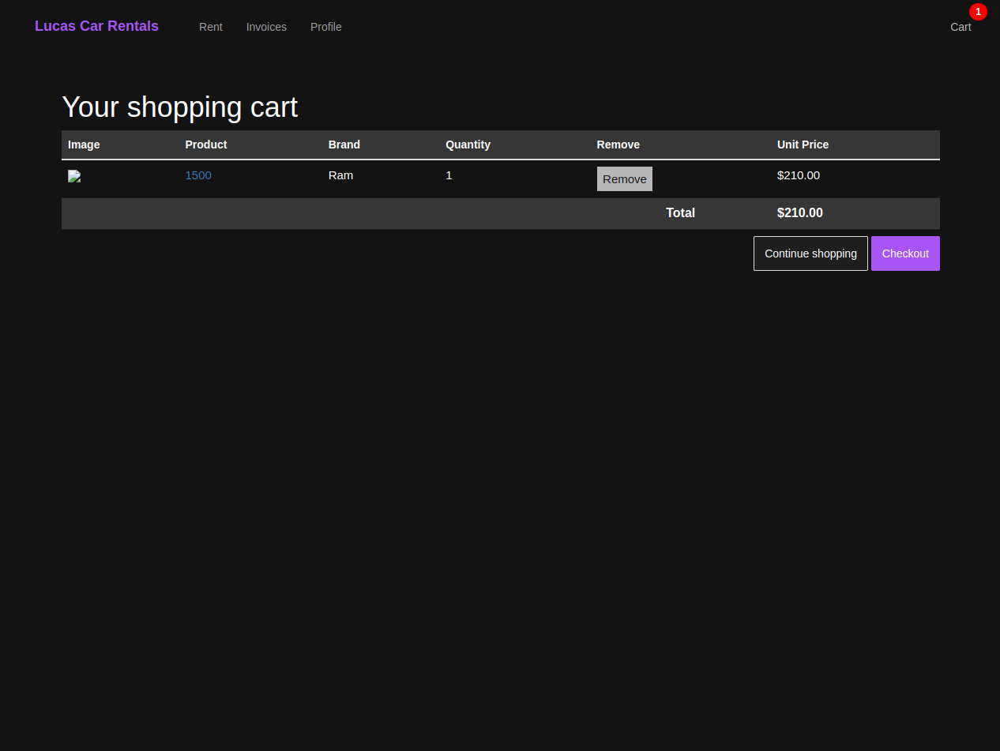
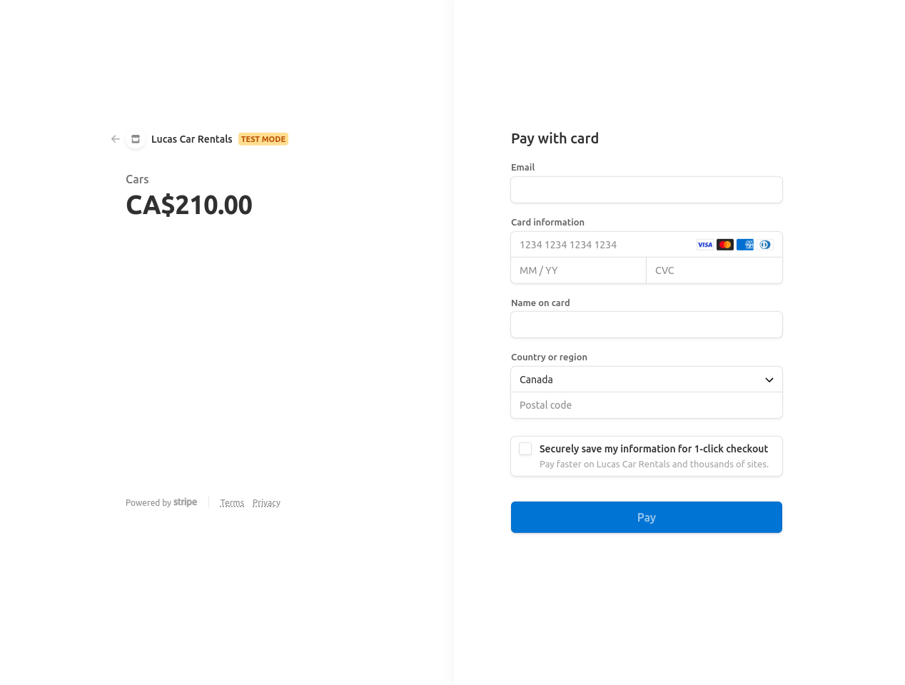
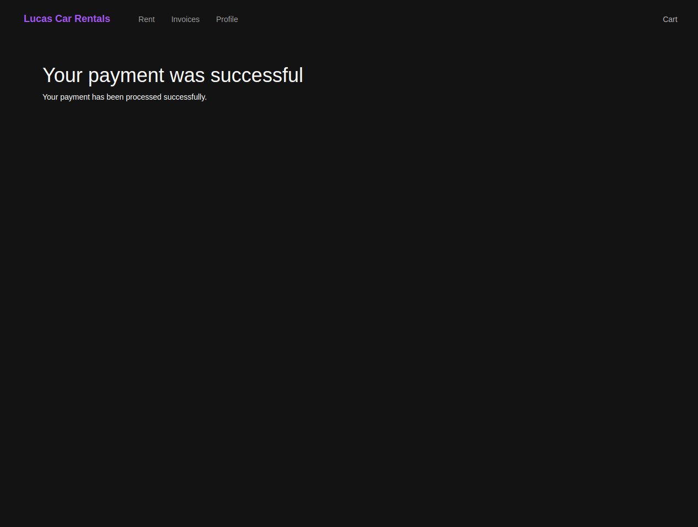

# Lucas Car Rentals
A rental service website that allows users to rent vehicles. Users must create an account in order to access the website. Once successful and the user has chosen a vehicle, the user must enter a shipping address and asked to pay via Stripe. An email will be sent to the email entered and an invoice will be created once the transaction has been completed. In order to return the vechile(s), simply logout of your account.

Live: https://lucascarrentals.herokuapp.com/

## Final Product

## Key Features
- Account creation
- Sessions
- Context processor
- Invoices for every transaction
- Process payments with Stripe

## Learning Outcome
- Creating custom user models with django
- Implemented a checkout session
  - Sessions to store and retrieve data for each user
  - Context processor to enable global variables
- Payment process done via Stripe API
- Emailing users once an order has been placed successfully
